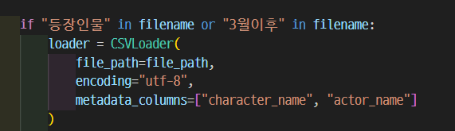

# SKN10-3rd-3Team

# LLM Document Q&A System

## 1. 주제 소개

이 프로젝트는 최신 LLM과 RAG(Retrieval-Augmented Generation) 기술을 연동하여,  
**사용자가 HTML 버튼으로 선택한 문서를 기반으로 질문에 최적의 답변을 제공하는 시스템**입니다.

특히 **연예 & 대중문화 정보**를 중심으로 한 내부 CSV 파일을 대상으로,  
간편하게 문서 선택 → 질의응답 흐름이 이루어지도록 설계되었습니다.

---

## 1.1 주제 관련 문제 분석

## 2. 팀 소개

- **팀명:** 3조 (SKN10-3rd-3Team)
<table>
  <tr>
    <th>신정우</th>
    <th>원유형</th>
    <th>김재혁</th>
    <th>신민주</th>
    <th>이서영</th>
  </tr>
  <tr>
    <td align="center"></td>
    <td align="center"></td>
    <td align="center"></td>
    <td align="center"></td>
    <td align="center"></td>
  </tr>
  <tr>
    <td align="center"><b>팀장</b></td>
    <td align="center" colspan="4"><b>팀원</b></td>
  </tr>
  <tr>
    <td align="center"><b>프로젝트 총괄</b> chainlit & html구현 드라마 csv데이터 수집 & 전처리 RAG & Tavily 성능 테스트</td>
    <td align="center"> chainlit 구현 드라마 csv데이터 수집 & 전처리 RAG & Tavily 성능 테스트</td>
    <td align="center"> 드라마,영화 csv데이터 수집 & 전처리 RAG & Tavily 성능 테스트</td>
    <td align="center"> 엔터테인먼트 기사 크롤링후 csv 생성 & 전처리 RAG & Tavily 성능 테스트</td>
    <td align="center"> 드라마,영화 순위 및 세부정보 크롤링후 csv 생성 & 전처리 RAG & Tavily 성능 테스트</td>
  </tr>
</table>

---

## 3. 주요 기능

- HTML 버튼을 통해 문서를 직접 선택
- 선택된 문서를 기반으로 RAG 시스템 구성
- Chainlit 기반 웹 인터페이스로 실시간 Q&A 제공
- CSV 기반 문서 로딩 성공 시, 해당 문서 기반 응답만 가능하도록 UX 제어

---

## 4. 사용된 문서 예시

**내부 문서 (CSV 포맷)**

- `폭싹 속았수다 등장인물.csv`
- `중증외상센터 등장인물.csv`
- `naver_entertainment_articles.csv`

※ 문서마다 column(metadata) 구조가 달라 다양한 Q&A 대화 가능

---

## 5. 핵심 기술

- **Chainlit + LangChain + OpenAI API**
- CSV 문서 불러오기 및 embedding 처리
- FAISS 벡터 DB를 통한 유사도 기반 문서 검색
- Streamlit 스타일 Chainlit UI로 UX 개선

---

## 6. 프로세스 흐름도

1. **문서 선택 (HTML 버튼)**
2. 선택된 CSV 문서 로드 및 LangChain 문서화
3. FAISS 벡터 DB로 임베딩 및 저장
4. 사용자 질의 입력
5. 선택된 문서를 기준으로 유사 문서 검색
6. LLM(OpenAI API)이 응답 생성
7. 결과를 Chainlit UI로 출력

*자세한 흐름은 아래 다이어그램 참고!*

---

## 7. 아키텍처

- **프론트엔드**: `index.html` → 문서 선택 버튼 UI
- **백엔드**: `app.py` → Chainlit 기반 LangChain + FAISS + OpenAI
- **벡터 저장소**: FAISS (로컬)
- **문서 처리**: CSV → LangChain 문서 → Embedding → Vector DB 저장

---

## 8. 우리 시스템만의 장점

| 구분              | 기존 챗봇       | 우리 프로젝트 챗봇       |
|------------------|----------------|--------------------------|
| 데이터 소스        | 고정된 공개 정보 | 선택한 문서 기반 응답        |
| 문서 기반 질문     | ❌ 불가         | ✅ 가능                   |
| 최신성 & 문맥     | 낮음            | 문서 기반으로 정확도 향상   |
| 사용자 맞춤화      | 제한적          | 선택 문서 기준 맞춤형 QA 가능 |

---

## 9. 기대 효과

- **문서 기반 응답**: 문서 내 실제 내용을 바탕으로 정확한 질의응답 가능
- **간편한 UI**: HTML 버튼 하나로 QA 시스템 초기화 가능
- **LLM 활용도 극대화**: 문서 기반 추론으로 정답률 및 신뢰도 향상
- **데이터셋 추가 용이**: 데이터셋과 출력 content 수정만으로 새로운 챗봇 생성가능

---

## 10. 개발과정중 발생 문제 & 해결방법

- **신정우** : 내부 외부 문서를 각각 따로 조회하는것은 문제가 없었습니다만, 동시에 조회를 하는 경우에 내부 문서의 존재유무에 신경쓰지 않고 모든 질문에 대한 답을 외부 검색(Tavily)으로 답하는 문제가 있었습니다. 저희는 이 문제를 강의시간에 배웠던 내부 문서를 먼저 조회 후, 관련있는 내용이 없다면 그 이후에 외부 검색을 실행하도록 하여 문제를 해결하였습니다. 또한 html페이지에서 chatbot 파일에 데이터셋에 대한 정보를 전달하는 과정에서 정말 사소하지만 못찾는 스타일의 문제가 있었습니다. 후에 chainlit에 대한 정보를 자세히 찾아보니 일반적인 session을 받아오는 방식은 통용되지 않았기에 chainlit에서 사용가능한 기능을 이용해 정상적으로 마무리하였습니다!
- **원유형** :  tavily로 tool을 만들어 llm과 chain해서 외부 검색을 하려 했는데 llm이 tool을 사용하지 않아 답이 오지 않는 문제 가 있었는데 tavily로 검색 결과를 가져온뒤 결과를 다시 llm에 prompt와 함께 보내는 것으로 해결하였습니다. 
- **김재혁** : 처음 RAG 모델을 쓸 때 csv 형식이 달라서 오류가 떴었는데 파일을 읽어오는 방식을 달리 하여서 문제를 해결하였다. 후에 느낀점은 파일을 읽어오는 방식을 달리하는거보다는 같은 형식으로 전처리를 했으면 됐지 않았을까라고 생각이 들었다
- **신민주** : 네이버 기사 크롤링 시 beautifulsoup을 사용했는데 코드에는 아무 문제가 없었지만 크롤링이 되지않았습니다. 찾아보니 네이버 기사 페이지가 동적이라서 셀레늄을 사용했어야했습니다. 그래서 셀레늄으로 코드를 바꿔 자료를 수집했습니다.
- **이서영** : 데이터를 수집하는 과정에서 사이트가 민감한 경우 크롤링에 실패하는 경우가 종종 발생하였습니다. 이를 해결하기 위해 대기시간 설정 및 배치 처리를 통해 차단 방지 및 크롤링 실패율을 감소시킬 수 있었습니다.

---

## 11. 프로젝트 후기

- **신정우** : 팀장이라는 자리는 한번 해봤다고해서 익숙해 지는게 아니었습니다. 주제는 점점 어려워 지고 제가 아는 지식은 한정적이라 굉장히 막막했는데 그때마다 팀원들의 도움이 있었기에 지금의 결과를 낼수 있었다고 생각합니다. 다시한번 팀원분들 정말 수고하셨고 고맙습니다!
- **원유형** : 그동안 배운 llm 활용 기술들을 프로젝트에 적용하면서 더 공부가 되었습니다. 팀원들이 각자 맡은 부분들을 잘 해주어서 마무리 할 수 있었습니다.
- **김재혁** : 내부&외부 검색 기반의 하이브리드 RAG 시스템을 구축해볼 수 있었어서 좋았습니다. 또한 Chainlit이라는 기술도 처음 알게되어서 배울게 있었던 단위프로젝트였습니다. 팀장님 최고!
- **신민주** : 잘하는 분들과 프로젝트를 진행하게 되어서 큰 어려움 없이 이번에 배운 내용을 직접 해볼 수 있어서 좋은 기회였습니다.
- **이서영** : 이번 프로젝트를 통해 데이터 수집 및 RAG에 대한 전반적인 경험을 할 수 있어 좋았습니다. 또한 힘써주신 팀원분들께 감사하다고 말씀 드리고 싶습니다. 감사합니다!